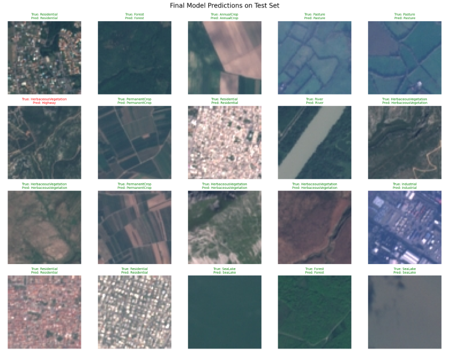

# Land-Use Classification from Satellite Images

This project presents a deep learning workflow for **classifying land-use types from satellite images** using the **EuroSAT** dataset.

The full analysis, preprocessing pipeline, model training, evaluation, and prediction examples are available in the notebook:
[`Classification_DL.ipynb`](./Classification_DL.ipynb)

## Project Objective

The main objective of this work is to **classify land-use types from satellite images**.

This design choice reflects real-world scenarios, where:
- multiple land-use patterns must be identified reliably from aerial observations,
- a large and well-structured image dataset improves model robustness and generalization,
- accurate land-use recognition can support environmental monitoring, urban planning, agriculture, and risk management.

## Notebook Content

The notebook is organized as a complete end-to-end pipeline:

1. **Introduction**
   Presentation of the land-use classification task and its practical relevance.
2. **Environment Setup and Dataset Access**
   Installation of dependencies and dataset retrieval with the Kaggle API.
3. **Dataset Overview**
   Loading the train, validation, and test splits from the EuroSAT dataset.
4. **Exploratory Data Analysis**
   Study of class distribution and visualization of representative images.
5. **Preprocessing and Data Augmentation**
   Image resizing, normalization, and augmentation adapted to satellite imagery.
6. **Modeling**
   Training and comparison of three convolutional neural network architectures:
   - `LeNet`
   - `ResNet18`
   - `EfficientNet-B0`
7. **Evaluation**
   Performance analysis using accuracy, precision, recall, F1-score, and confusion matrices.
8. **Best Model Selection**
   Comparison of the three approaches to identify the strongest classifier.
9. **Prediction Examples**
   Visualization of predictions on random samples from the test set.
10. **Conclusion and Perspectives**
    Summary of findings and possible improvements.

## Main Result

Among the tested models, **ResNet18** achieved the best overall performance, with an accuracy of about **96.5%** on the test set. It provides the most reliable balance between precision, recall, and generalization for this classification task.

## Files

- [`Classification_DL.ipynb`](./Classification_DL.ipynb): main notebook containing the full workflow
- [`Final_model.png`](./Final_model.png): image illustrating the final model result

## Notes

The notebook was developed in a workflow compatible with **Google Colab**, including:
- Kaggle dataset download,
- optional use of GPU,
- loading saved checkpoints from Google Drive.

